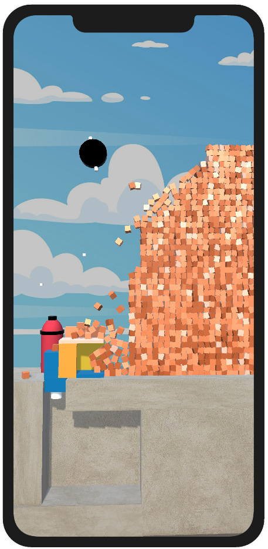

## Bucket Crusher Created with Unity

## Project Information
- Assigned as a Task
- Unity Version: 2021.3.9f1
- Start Date: 09.04.2022
- Duration: 7 Days (7*24 Hours)

## Development Timeline

## Day 1 (09.04.2022)
Played the game for about half an hour. I think they have used voxel system for the cubes and Inverse Kinematics for the Crusher Body. I would like to focus on these issues first.
- Generate Voxel System
- Inverse Kinematics for Crusher
- Created the crane base and Map base

  

## Day 2 (09.05.2022)
Yesterday the IK was added with Final IK asset. The Final IK seems to be an advanced asset and I feel like the games IK system can be more simpler one with limited complexity. 
So today I decided to work on a simpler IK from scratch.
- Added Gameplay UI System
- Observer Pattern in action along with Singleton Pattern
- Score system initiated. Score Display Works -> On Next: Score Coin Instantiator

<b> Overall Basic Gameplay Skeleton is ready and now the game reacts for voxel system on spike. The Crane Follows Spike with IK System. Voxel cubes generates money once they are destroyed </b>
  

<b> Challenge Arised </b>: [Academic] POL101 Final Policy Brief Deadline within 72 Hours.