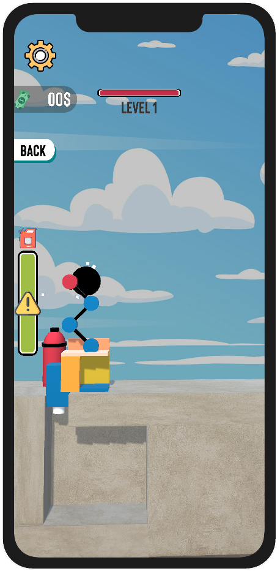

## Bucket Crusher Created with Unity

## Project Information
- Assigned as a Task
- Unity Version: 2022.1.15f1
- Start Date: 04.09.2022
- Duration: 7 Days (7*24 Hours)

## Development Timeline

## Day 1 (04.09.2022)
Played the game for about half an hour. I think they have used voxel system for the cubes and Inverse Kinematics for the Crusher Body. I would like to focus on these issues first.
- Generate Voxel System
- Inverse Kinematics for Crusher
- Created the crane base and Map base
 

## Day 2 (05.09.2022)
Yesterday the IK was added with Final IK asset. The Final IK seems to be an advanced asset and I feel like the games IK system can be more simpler one with limited complexity. 
So today I decided to work on a simpler IK from scratch.
- Added Gameplay UI System
- Observer Pattern in action along with Singleton Pattern
- Score system initiated. Score Display Works -> On Next: Score Coin Instantiator

<b> Overall Basic Gameplay Skeleton is ready and now the game reacts for voxel system on spike. The Crane Follows Spike with IK System. Voxel cubes generates money once they are destroyed </b>
  

<b> Challenge Arised </b>: [Academic] POL101 Final Policy Brief Deadline within 72 Hours.

## Day 3 (07.09.2022)
Resumed working on the game after one day break in between. Today I have planned to work on bringing the game to next step

- Spike/Player Traversal limited within radius
- Worked on UI System [Progress Bar, Gas Bar, Game Over System]
- Floating Joystick Control
- Slightly tried the Physics Based interaction

<b> Primarily, for the next updates the idea is to make coupled component decoupled. The current implementation of singleton arises coupling issue for scalable projects. Will change the Singletons with Scriptable Objects.  </b>

## Version Change Log
The Unity 2021.3.9f1 LTS was facing engine bugs. The Script and editor pipeline was not synced properly along with showing weird bugs like GameObject has been destroyed while those objects were intact on the scene. Had to upgrade to 2022.x.x to avoid any further issues.

## Day 4 (08.09.2022)
- Player Pivot Updated
- UI Mechanics Furnished

## Day 5 (09.09.2022)
- Player Movement Script Updated with Clamped System
- Camera Follow System Integrated
- Added Strength Collision system to Spike
- Shifted Triggers under parent
- Added Scriptable Singleton System
- Introduced PlayerPrefs, PreferenceSingleton and Audio Manager

## Day 6 (10.09.2022)
- Worked on Character Control a bit more
- IK System had to be reoriented
- Collision Physics Integrated for Variable Strength System
- Coin Instantiation process initiated. Integrated Unity Object Pooling Mechanics
- Gameplay UI Furnished

I was highly interested to implement the new Unity DOTS Physics mechanics for the voxel cubes. But as the task is near deadline not going to stretch to that end.

## Day 7(11.09.2022)
- Upgradation System and UI 
- PlayerPrefs Introduced
- Settings and Gameplay UI Reworked

